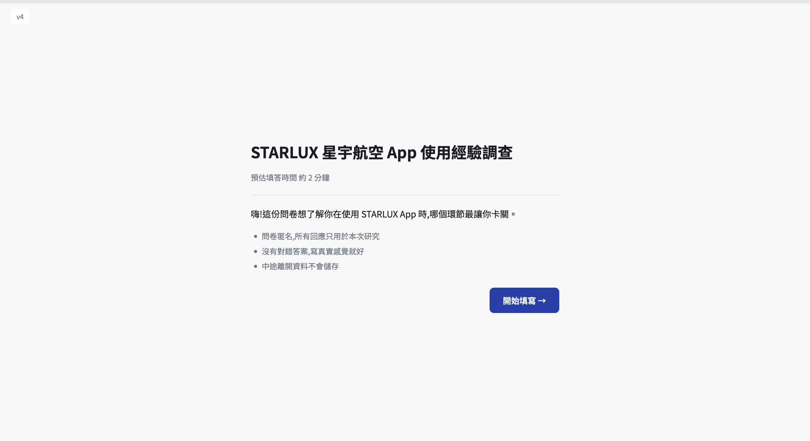
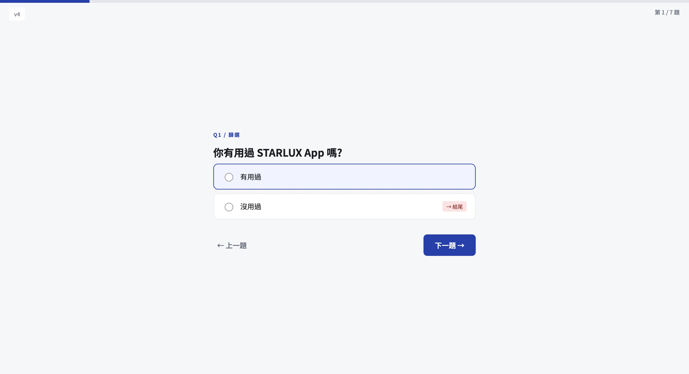
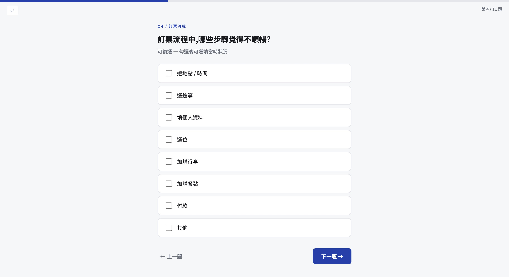
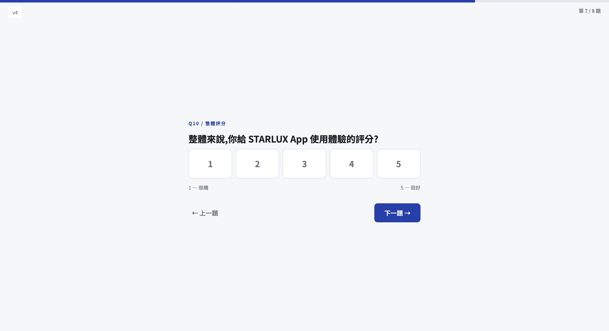

# Friction Finder

[繁體中文](README.md) ・ **English**

> A full-stack implementation of a "STARLUX App experience" survey — extended from a UI/UX redesign exercise into a real, deployable online survey that collects responses.
> Vue 3 single-page survey (dynamic branching), Spring Boot SP-driven API, PostgreSQL + Flyway, CI/CD to the cloud.

<sub>A personal UI/UX research and engineering exercise (Redesign Project). All trademarks / company names belong to their respective owners; for academic and portfolio exchange only, with no commercial purpose.</sub>

---

## 🖼 Screenshots

<table>
  <tr>
    <td width="50%"></td>
    <td width="50%"></td>
  </tr>
  <tr>
    <td></td>
    <td></td>
  </tr>
</table>

## ✨ Features

- **Dynamic branching survey**: a screener filters out non-target respondents; detail questions are inserted dynamically based on which flows the user has used; progress and question count reflect the branch in real time.
- **Multiple question types**: single / multi choice / multi-select with per-option comment / 1–5 scale / open text / interview opt-in (PII isolated).
- **Bilingual + theming**: instant zh / en switch and light / dark mode, both persisted.
- **Works without a live API on load**: questions are inlined into the bundle at build time; the backend is only hit on submit.
- **Guards**: debounced submit lock, invalid-route / skip-ahead guards, custom 404, backend rate limit + origin allowlist.

## 🏗 Architecture

```
User ──HTTPS──> Cloudflare Pages (static frontend)
                    │  /api  (TLS terminated at the edge)
                    ▼
            Azure Container Apps (Spring Boot, HTTP)
                    │  over a Tailscale private network
                    ▼
            Self-hosted PostgreSQL (not exposed to the internet)
```

TLS is terminated at the edge, so the app itself runs plain HTTP. The frontend uses a relative `/api` (Vite proxy in dev, the HTTPS backend in prod) to avoid mixed content. The database lives only on a private network and is never exposed publicly.

## 🛠 Tech Stack

| Layer | Tech |
|---|---|
| Frontend | Vue 3 (Composition API) ・ Vite ・ TypeScript ・ Tailwind CSS v4 ・ Pinia ・ Vue Router ・ vue-i18n ・ axios |
| Backend | Java 21 ・ Spring Boot ・ JdbcTemplate (SP-driven, no ORM) ・ bucket4j ・ springdoc OpenAPI |
| Data | PostgreSQL ・ Flyway (versioned migrations) ・ plpgsql stored functions |
| Test / CI | Testcontainers ・ GitHub Actions → GHCR → Azure Container Apps |

## 🔑 Engineering Highlights

- **SP-driven API**: all reads/writes call PostgreSQL functions instead of an ORM. On submit, `submit_survey()` resolves labels from the definition tables by `questionId` / `answerId` and stores them as a **snapshot** — the frontend payload only sends IDs (lean, and the text comes from the DB so it can't be tampered with).
- **Build-time question inlining**: a `prebuild` step fetches the survey from the backend and freezes it into the bundle as JSON, falling back to a cached copy if unreachable — zero API dependency on page load.
- **Dynamic flow engine**: a pure frontend composable computes the active question order, progress, prev/next, and branching/screen-out from the current answers.
- **Versioned question schema**: questions evolve via Flyway migrations (append-only, never edited in place), so historical responses point to the version that was actually shown.
- **Clean scale data model**: scale options store only the number (1–5); the endpoint anchor labels live in the UI — conceptually a star rating.
- **Edge-TLS architecture**: the app is plain HTTP with TLS terminated at Cloudflare / the container ingress, reducing certificate and mixed-content complexity.
- **Abuse protection**: bucket4j per-IP rate limiting, an Origin allowlist filter, and Swagger disabled in production.

## 🚀 Local Development

**Backend** (requires Docker + JDK 21)
```bash
cd backend
cp .env.example .env           # fill in local DB values
docker compose up -d           # start PostgreSQL
./mvnw spring-boot:run         # start the API (Flyway builds schema + seed automatically)
```

**Frontend** (requires Node 20+)
```bash
cd frontend
cp .env.example .env
npm install
npm run dev                    # https://localhost:5173 (local HTTPS via mkcert)
```

## 📦 Deployment

- **Frontend**: Cloudflare Pages (static); `public/_redirects` provides the SPA fallback so deep links don't 404.
- **Backend**: GitHub Actions builds a multi-stage image → pushes to GHCR → updates Azure Container Apps; the DB is reached over a Tailscale private network.
- All config is env-var driven (`${VAR:default}`) — no code changes between dev and prod.
